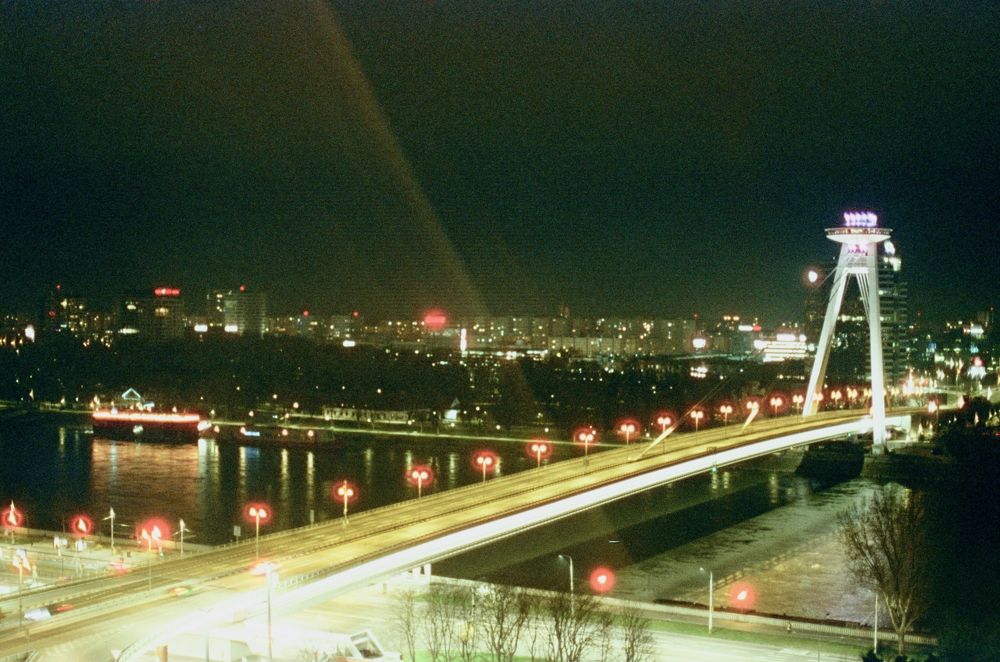
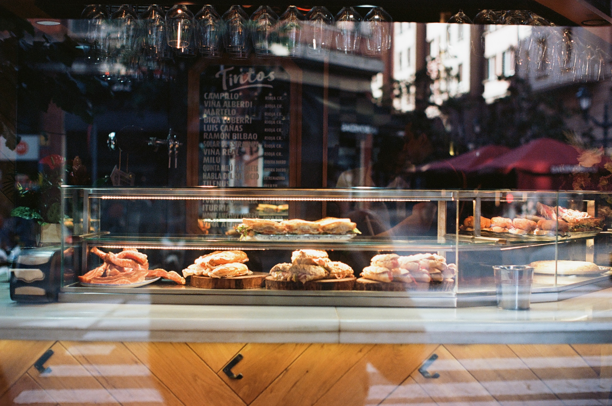

One year, dozens of rolls, no regrets but I don’t think I’ll be shooting colour film any more. Read on to find out why.

A year ago, I haggled to get a film camera for just €15 at a market in France. As a predominantly digital shooter yet with over a decade of experience shooting black and white film; I decided to experiment with colour film. This is a review of my experiences with different films, my thoughts, the lessons I’ve learned and why I ultimately have decided to give up on colour film.

## Part 1: first impressions 
Having had a break from film photography for around a year, I happened on a Yashica TL Electro with a 50mm ƒ/1.4 lens in a market around Christmas 2023. The camera appealed to me and looked in fairly good condition, so I parted with €15 and took it home to give it some TLC.

Now armed with a new camera and having seen countless posts and videos about how great colour film was, I decided to try colour for the first time. My goal initially was to try it and see how I liked it, just to experiment.

I popped into a local shop and picked up a box of Kodak gold, which I understood as a good all-rounder film to start with.

That first roll of Kodak gold was quickly filled with a variety of shots from around my hometown of Brighton. The novelty of both the camera and media imbued my photography with a sense of fun. Consequently I was pleasantly surprised with the images I took.
<!-- {"width":647} -->
<!-- {"width":325} --><!-- {"width":323} -->
<!-- {"width":647} -->

Encouraged by this initial good impression, I was excited to explore and shoot more. After some research, I bought some rolls of Kodak Ektar to try out. Then I needed to try to photograph new environments and scenery, travel seemed like a perfect opportunity.

## Part 2: travel photography 
My first trip was to the Fête du citron in Menton on the French Riviera. I got through two rolls of Ektar and a roll of Ilford Delta 100. I got some great images from the trip, Ektar produced much higher contrast images with a more pleasing colour palette.<!-- {"width":323} --><!-- {"width":325} -->
<!-- {"width":293} -->

I tried a more experimental film with Candido 400, which I shot in Bratislava. I was not a fan of this film at all. Awful colours, a bluish tint and too much halation. I don’t think it helped that it went through airport scanners but my other films weren’t affected like that.
<!-- {"width":325} --><!-- {"width":325} -->
Over the last year I’ve shot film on several trips: both colour and black and white alongside digital. Many of the images I’ve taken on film have been favourites. I’ve loved the colour, texture and process of taking them. It’s been a creative and fun experience.<!-- {"width":325} --><!-- {"width":325} -->

## Part 3: creative impact
The limitations of film photography are often celebrated as constraints that engender creativity. You’re stuck with a single ISO, a single baked-in ‘look’, it’s hard or impossible to take a burst depending on the camera, and you can take at most 36 shots at once. Then you have no idea what the final image looks like until you develop and print/scan it.

Also, there is a degree of unpredictability involved; light leaks, halation, exposure issues and more, can create novelty. However, these effects are not really part of the photographer’s creative choice.

The main difference I find between shooting film and digital is that I am limited to the single ISO so I have to be more careful with the types of shots I take. I can’t shoot the same roll with a greater choice of shots in all conditions, day and night. When shooting colour rather than black and white film, I look not just for interesting light and structure but also bold colours. The final images are more relatable.

Black and white images, for me, create an interpretation of the scene that is more artistic. The photographs need to make use of light and contrast, compositon is far more important. Not all colour shots would work in black and white but most black and white shots could work in colour. Colour can be artistic too but is often emotional. It can make you feel as if you’re there, as you can create more of a sense of it being what the viewer might see themselves. Mundane scenes can be like looking at a memory. Bright colours can be relied upon to grab a viewer’s attention.

## Part 4: looking back and thinking forward
Looking back, I am very happy with many of the photos I took. However I can’t really see anything is added by shooting on film over digital. Digital would honestly let me get more out of each image. I value predictability and creative control.

Then there is the cost involved, a single roll of Ektar can now cost £20 (though I haven’t spent that), even the cheapest rolls are well over £10 and slide film like E100 and velvia are £30+. Buying in bulk requires a large initial investment in film and equipment, and then leaves you even more tied to a single ‘look’. On top of that, there’s the cost of development and scanning which ranges from £2–15+ per roll depending on whether you home or lab develop.<!-- {"width":325} --><!-- {"width":325} -->

Black and white film has an engaging process and more distinct images. As I’ve mentioned, the images have a unique character. Development is also much more part of the creative process, different timings, chemicals and actions all give creative control over the final image in a way I don’t really think there is with colour.

## Part 5: The honest truth
Bluntly, I’m not sure what you’re paying for with colour film. Novelty, superiority over digital shooters, imagined nostalgia? Are the old manual film cameras fun, yes absolutely. Is the image delightful, I’d argue no more than digital.

I can create images on digital that I’m sure would be indistinguishable from film for anyone. On the other hand film images can never achieve what I can do with digital. There are a couple of times that perhaps film could be considered ‘better’ in terms of output, but it’s still more limited and requires large formats at an even greater expense.

## Conclusion
Shooting colour film over the past year has been a fun experiment — nostalgic, a mix of fun and frustrating, but ultimately not for me.

Colour film, for all its charm, feels like a relic I don’t need. The cost is high, the control is limited, and the results are nothing special. At best I end up with delightful images. At worst I am dismayed by poor colours, defects and images that look like bad tourist snapshots from 1999 with little I can do to rescue them.

I will take what I’ve liked and learned from film and apply it to my digital photography, just as I have done with my black and white photography.

If you’re curious about colour film, I’d still recommend you try and I’ll write a mini guide on what I like and didn’t soon.
