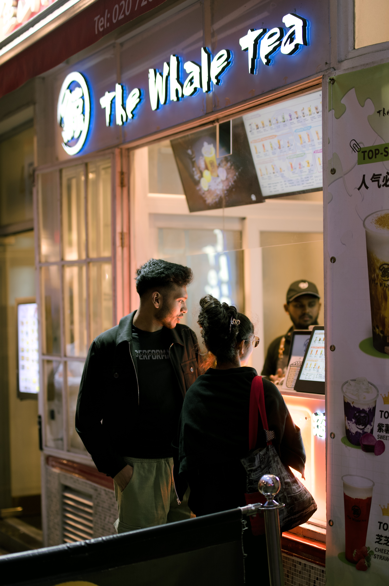

A photograph often struggles to reproduce what we can actually see, the colours and light cannot match the real world.

While modern cameras have fantastic dynamic range it is unfortunately compressed into the same small range for display. This can lead to the images appearing worse as they lack that contrast. While older images were often praised for their high contrast and more edgy look.

Wanting to get more out of my images I started to explore HDR at first experimenting mainly with night scenes lit by bright lights but then more generally too.

When I first started exploring HDR, I came across [Greg Benz](https://gregbenzphotography.com), he has an incredible site full of information, resources and examples some of the key takeaways for me were:  
* If you shoot in RAW, you already likely have more than enough dynamic range. No need for bracketing.
* Use HDR gain maps and the images should look good for everyone’s display
* Take a moment before you shoot:
  - Check the histogram.
  - Avoid clipping in the highlights.
  - You can usually recover the shadows well as long as the image is well-exposed.
  
Done with intention, HDR reveals the scene more closely as you *saw*, not a fantasy or gaudy version of it.

## Before and After Examples

  
  

---

## Why This Matters:

- **RAW files have more range than we use** — shooting raw obviously has other benefits in editing but if you shoot a good image in camera then you’re throwing away a lot of dynamic range for no reason.
- **It opens a new dimension** — all that extra brightness means you can push the highlights without them clipping. Now rather than trying to squeeze the tones of an image into a limited range you can tease them out with even higher contrast images. 
- **More honest images** — where the glow of a sunset and the detail of the land coexist naturally.

I’ve used HDR on many shots now: city streets at dusk, in forests, by the sea. Using various software: Lightroom, Photoshop, Pixelmator, Darktable. I’ve even converted some film scans into HDR. 

Done well it can bring more life and reality into an image, make the lights actually glow and create a scene where everything can be well-exposed without it looking fake or washed out.
